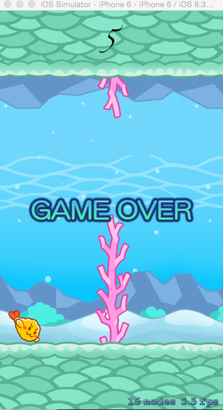

#SpriteKit の利用

書籍： Sprite Kit iPhone 2Dゲームプログラミング 4 章 のゲームをリファクタリングした。
See  http://www.shuwasystem.co.jp/support/7980html/4055.html

## 操作：
タップで魚が上に移動します。  
サンゴ、地面に魚がぶつかるとゲームオーバーです。  
ゲームオーバー画面でタップすると、ゲームを再開します。  

## 改良点
- 類似コードを関数にまとめた。
- なるべく定数を Constants に集めた。

